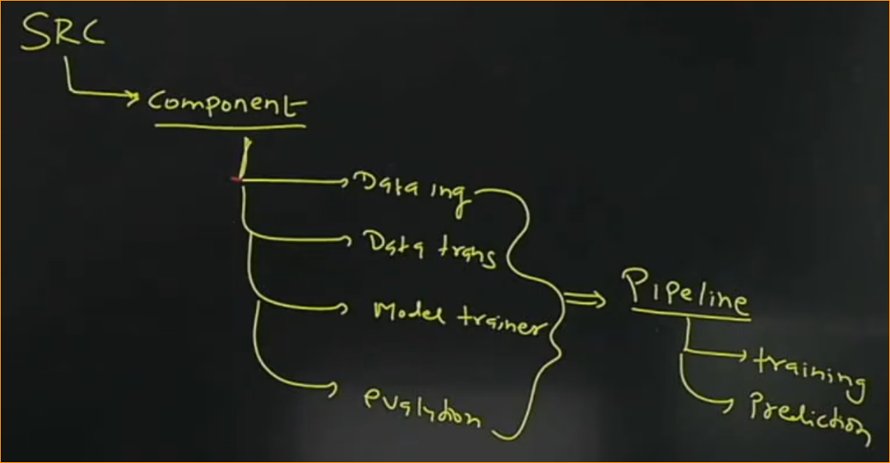

# end-to-end-used-car-price-prediction

**MLOps == ML + Ops**

**ML**
1. Data Gathering
2. EDA
3. FE (data transformation)
4. Model building
5. Model evaluation

**Ops**
6. Deploy
7. Maintain & Monitor
8. Retraining

`Step-By-Step-MLOps-Project-Workflow`

1. Create a GitHub repository for the project using the "Python" .gitignore template and MIT License. Then, clone the repository to local system: git clone <repo URL>

2. Create project file/folder structure using template.py OR we can create this project repo by cloning from template repo
    git repo url: `https://github.com/iamprashantjain/end-to-end-used-car-price-prediction`

3. Continuous Integration (CI) is a software development practice where developers frequently integrate their
code into a shared repository multiple times a day. Each integration (or "commit") is automatically tested to detect
issues early, enabling teams to identify and address bugs as soon as they arise. The goal of CI is to improve software
quality and reduce the time it takes to deliver updates.

4. - .github folder contains workflows where we will keep config files for CI
   - experiment is a jupyter file where we will perform eda, transformations etc, we can create seperate files also
   - src is the main folder where we will keep all components of machine learning like training, transformation, model building & evaluation and pipelines like prediction & training pipeline. we will also keep exception, logger & utils files in this folder
   - test folder is for testing the code, single unit test & integration testing
   - .gitignore is the file which has information of all files which should be ignored while pushing code files to github
   - init_setup.sh is the sheel script where we can write all cmd commands like venv activation etc
   - pyproject.toml, setup.py & setup.cfg are all configuration files
   - tox.ini is the fils to perform testing automatically as soon as we push the code to github
   - 2 requirement files: for development & for production

5. There is no need to upload code to pypi unless you want others to use your repo in thier code, ml projects are of no use for others so we dont need to upload that code to pypi

6. Docker to containerize the code

7. `No we can begin with the project implimentation and we'll learn other tools in between like MLFlow, DVC, Airflow`

8. We can also incorporate webscraping the data `ETL Pipeline` and use that data in data ingestion, transformation, model building, evaluation and then use MLOps tools to deploy, maintain and monitor

9. Currently, We will impliment end to end machine learning project:
    1. Building the project `git, github, python`
    2. Test: unit & integrated `pytest, tox`
    3. Deliver the project using `docker image on github action server saved on azure`
    3. Deploy using (CI/CD concept) `All above (CI) will be done on Github Action Server`
    4. Monitor the project `Evidently.AI`
    5. Retraining `(CT concept) using Airflow`
    6. `DVC` for data management
    7. `MLFlow` experiment tracking 
    8. `Dagshub/BentoML` for model registry

10. We will start with Jupyter notebook implimentation of the project
11. Perform modular coding
12. Adding variuos tools
13. Deployment

**Project Description**
- This project involves building an end-to-end machine learning pipeline for predicting used car prices. The process will include:

1. Web Scraping: Automating the extraction of used car data from the Cars24 website.
2. Model Development: Building and training a machine learning model to predict car prices based on the scraped data.
3. Deployment: Deploying the model in a production environment using Docker and GitHub Actions.
4. Monitoring & Retraining: Continuously monitoring model performance and automatically retraining the model as new data is scraped.

- The goal is to streamline the entire workflow, from data collection to model deployment and ongoing improvements.

14. Update setup.py file & Update `init_setup.sh` script to execute all commands in 1 shot, use `bash init_setup.sh` to run the script in bash terminal (if venv not activated then activate it manually since source activate is for gitbash/linux system not windows powershell or cmd)

15. Initiate the project implementation in a Jupyter notebook (experiments.ipynb), or alternatively, organize and document the project files. Ensure that you outline and define all key steps, including data cleaning, transformation, feature engineering, and model selection, as part of the experimentation process. This will make it easy to convert into modular coding and also at the time of re-training model with new data.

16. Once everything is experimented in jupyter, we can start write modular code

17. Write code for exception and logging

18. components -- 

In each component: DI, DT, MT, ME there are 2 things:
    1. config: path of the output
    2. artifcats: output

- for example: In data ingestion config, we will define path of the output files and then whatever will be the output after the data ingestion process, it will be saved on those paths and will be used by next component. In data transformation, it will read output data from the paths defined in config of data ingestion and perform transformation and save the preprocessor in the path defined in data transformation config and so on.. 

19. Write code for data ingestion and incorporate intial data cleaning in the same script.

11vid - 2:04