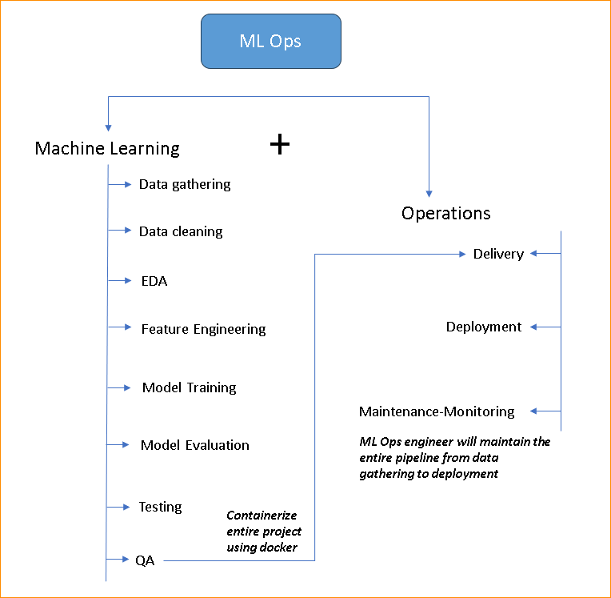
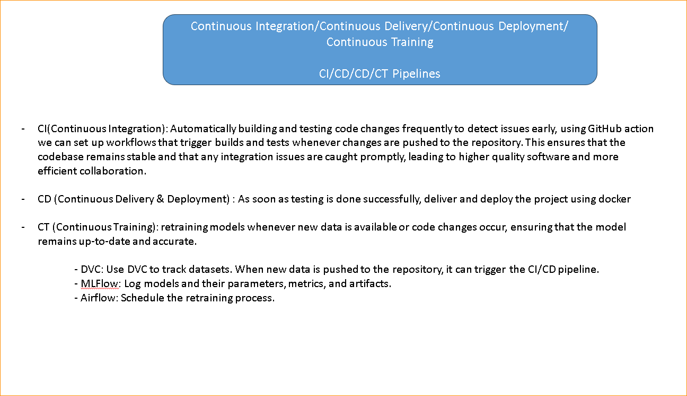
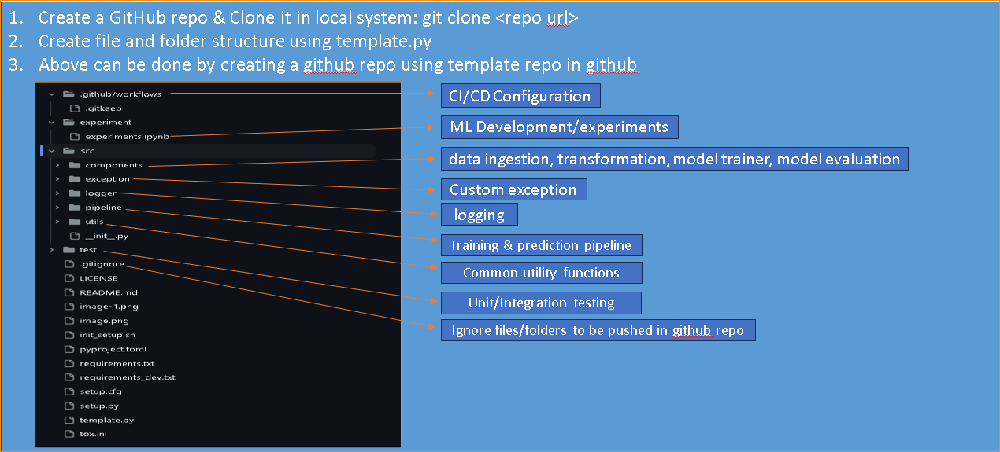
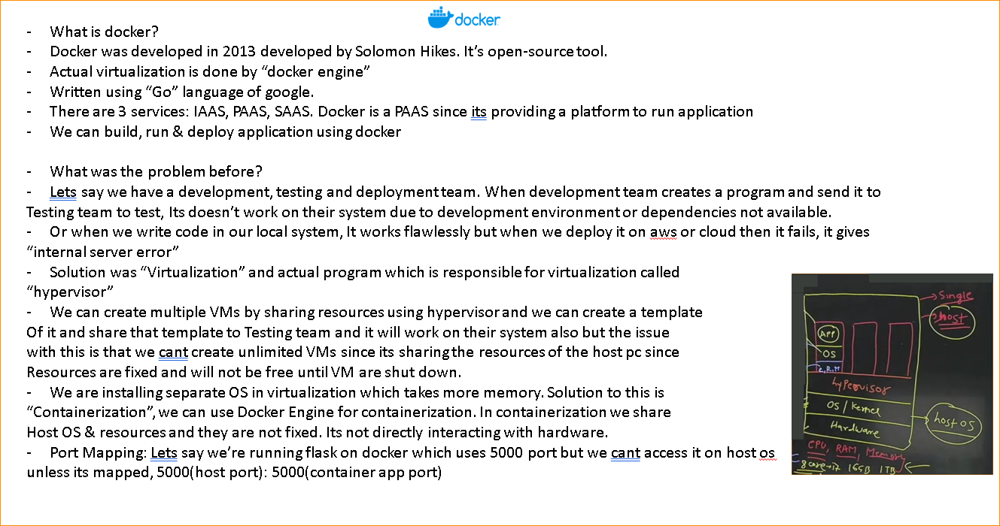
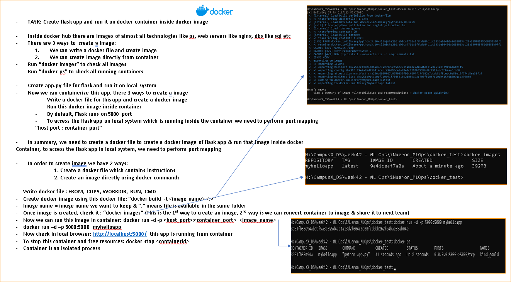
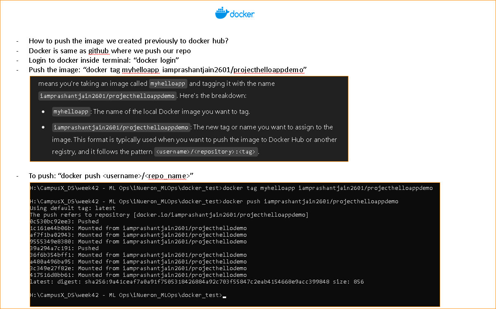
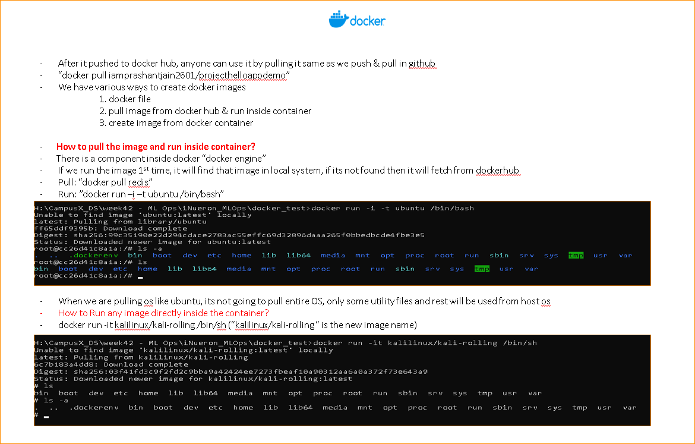
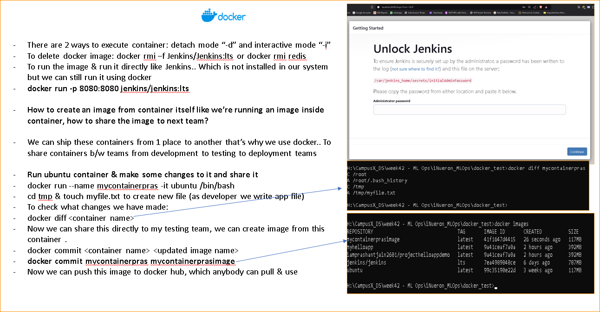

# end-to-end-used-car-price-prediction

**MLOps == ML + Ops**

**ML**
1. Data Gathering
2. EDA
3. FE (data transformation)
4. Model building
5. Model evaluation

**Ops**
6. Deploy
7. Maintain & Monitor
8. Retraining

`Step-By-Step-MLOps-Project-Workflow`

1. Create a GitHub repository for the project using the "Python" .gitignore template and MIT License. Then, clone the repository to local system: git clone <repo URL>

2. Create project file/folder structure using template.py OR we can create this project repo by cloning from template repo
    git repo url: `https://github.com/iamprashantjain/end-to-end-used-car-price-prediction`

3. Continuous Integration (CI) is a software development practice where developers frequently integrate their
code into a shared repository multiple times a day. Each integration (or "commit") is automatically tested to detect
issues early, enabling teams to identify and address bugs as soon as they arise. The goal of CI is to improve software
quality and reduce the time it takes to deliver updates.

4. - .github folder contains workflows where we will keep config files for CI
   - experiment is a jupyter file where we will perform eda, transformations etc, we can create seperate files also
   - src is the main folder where we will keep all components of machine learning like training, transformation, model building & evaluation and pipelines like prediction & training pipeline. we will also keep exception, logger & utils files in this folder
   - test folder is for testing the code, single unit test & integration testing
   - .gitignore is the file which has information of all files which should be ignored while pushing code files to github
   - init_setup.sh is the sheel script where we can write all cmd commands like venv activation etc
   - pyproject.toml, setup.py & setup.cfg are all configuration files
   - tox.ini is the fils to perform testing automatically as soon as we push the code to github
   - 2 requirement files: for development & for production

5. There is no need to upload code to pypi unless you want others to use your repo in thier code, ml projects are of no use for others so we dont need to upload that code to pypi

6. Docker to containerize the code

7. `No we can begin with the project implimentation and we'll learn other tools in between like MLFlow, DVC, Airflow`

8. We will automate webscraping the data `ETL` and use that data in data ingestion, transformation, model building, evaluation and then use MLOps tools to deploy, maintain and monitor

